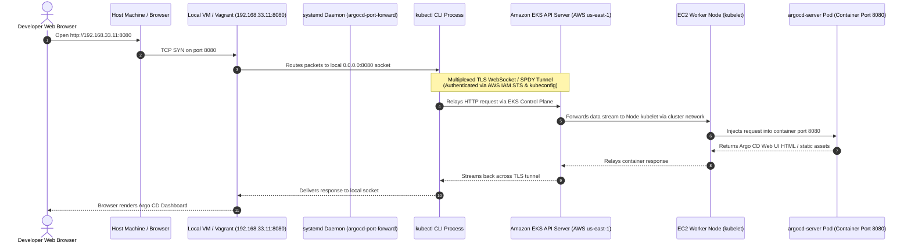

# ShopSphere Stage 10: Argo CD Port-Forwarding & Local Access Guide

---

## 1. Overview & Architecture

In production Kubernetes environments, administrative control planes such as **Argo CD**, **Grafana**, or the **Kubernetes Dashboard** are intentionally deployed using the **`ClusterIP`** service type within private subnets. This guarantees:
1. **Zero Public Attack Surface**: The management interface is not exposed to the public Internet.
2. **Cost Optimization**: No unnecessary AWS Elastic Load Balancers ($18+/month per ALB/NLB) are provisioned for administrative tasks.
3. **IAM RBAC Security**: Only authenticated engineers with active AWS IAM permissions to the Amazon EKS cluster can access the interface.

To access the Argo CD Web UI running on the remote Amazon EKS cluster (`shopsphere-stage10-eks`) from your local workstation or browser, traffic is bridged through a **secure, encrypted Kubernetes API tunnel** using `kubectl port-forward` managed as a **persistent, self-healing systemd service**.

---

## 2. Request Flow Architecture



---

## 3. Step-by-Step Implementation Process

### Step 1: Verify Kubernetes & AWS Environment

Ensure your local workstation or VM has an active `kubeconfig` context pointing to the target EKS cluster:

```bash
# 1. Update local kubeconfig with EKS cluster credentials
aws eks update-kubeconfig --region us-east-1 --name shopsphere-stage10-eks

# 2. Verify connectivity to the cluster
kubectl cluster-info

# 3. Verify that the Argo CD server service is active in namespace 'argocd'
kubectl -n argocd get svc argocd-server
```

Expected output:
```text
NAME            TYPE        CLUSTER-IP      EXTERNAL-IP   PORT(S)          AGE
argocd-server   ClusterIP   172.20.101.19   <none>        80/TCP,443/TCP   150m
```

---

### Step 2: Retrieve the Initial Admin Credentials

Argo CD generates a random base64-encoded initial password during deployment, stored in the Kubernetes secret `argocd-initial-admin-secret`:

```bash
kubectl -n argocd get secret argocd-initial-admin-secret \
  -o jsonpath="{.data.password}" | base64 -d && echo ""
```

* **Default Username**: `admin`
* **Default Password**: *(Retrieved string from command above, e.g. `dBQi0hPR8iV2PG8I`)*

---

### Step 3: Test Ad-Hoc Port-Forwarding (One-Off Verification)

Before automating the connection, verify that port-forwarding functions interactively:

```bash
# Bind to all network interfaces on port 8080 forwarding to service port 80
kubectl -n argocd port-forward --address 0.0.0.0 svc/argocd-server 8080:80
```

> [!NOTE]
> * `--address 0.0.0.0`: Binds to all network adapters on the local machine (including localhost, private VM IPs, and LAN IPs), allowing external browser connections from your host workstation.
> * `svc/argocd-server 8080:80`: Maps local port `8080` to Kubernetes service port `80` (which routes internally to container port `8080`).

Verify in another terminal:
```bash
curl -I http://127.0.0.1:8080/
```
Expected output:
```text
HTTP/1.1 200 OK
Content-Type: text/html; charset=utf-8
```

Press `Ctrl+C` to terminate the manual session once verified.

---

### Step 4: Configure Persistent, Self-Healing Background Daemon (`systemd`)

Manual `kubectl port-forward` commands terminate whenever the terminal is closed, when a laptop sleeps, or if a transient network blip drops the AWS connection. 

To make this completely persistent and automatic, we create a dedicated **`systemd`** system service.

#### 1. Locate the `kubectl` Binary & Kubeconfig
```bash
which kubectl
# Example output: /usr/local/bin/kubectl or /home/vagrant/.local/bin/kubectl

echo $HOME/.kube/config
# Example output: /home/vagrant/.kube/config
```

#### 2. Create the systemd Service Unit
Create `/etc/systemd/system/argocd-port-forward.service`:

```bash
sudo bash -c 'cat << "EOF" > /etc/systemd/system/argocd-port-forward.service
[Unit]
Description=Argo CD Web UI Persistent Port-Forward
Documentation=https://argo-cd.readthedocs.io/
After=network.target network-online.target
Wants=network-online.target

[Service]
Type=simple
User=vagrant
Group=vagrant
Environment=KUBECONFIG=/home/vagrant/.kube/config
ExecStart=/usr/local/bin/kubectl -n argocd port-forward --address 0.0.0.0 svc/argocd-server 8080:80

# Auto-reconnection & Self-Healing directives
Restart=always
RestartSec=3
StartLimitIntervalSec=60
StartLimitBurst=10

# Security and resource safeguards
LimitNOFILE=65536
StandardOutput=journal
StandardError=journal

[Install]
WantedBy=multi-user.target
EOF'
```

#### Key Directives Explained:
* `User=vagrant`: Runs under the user account where AWS credentials and kubeconfig are configured (avoids running network clients as root).
* `Environment=KUBECONFIG=...`: Explicitly passes the cluster configuration file location.
* `Restart=always`: If the connection drops (due to pod rescheduling, network interruption, or AWS timeout), systemd automatically restarts the command.
* `RestartSec=3`: Waits 3 seconds before reconnecting to prevent rapid flapping.
* `WantedBy=multi-user.target`: Automatically starts the service on machine boot.

---

### Step 5: Enable & Start the Service

Reload the systemd manager configuration and enable the service:

```bash
# 1. Reload systemd daemon to pick up the new unit file
sudo systemctl daemon-reload

# 2. Enable service on boot and start immediately
sudo systemctl enable --now argocd-port-forward.service

# 3. Verify service status
sudo systemctl status argocd-port-forward.service
```

Expected active status:
```text
● argocd-port-forward.service - Argo CD Web UI Persistent Port-Forward
     Loaded: loaded (/etc/systemd/system/argocd-port-forward.service; enabled; preset: enabled)
     Active: active (running) since Tue 2026-10-06 16:19:20 UTC; 5m ago
   Main PID: 43495 (kubectl)
      Tasks: 7 (limit: 1089)
     Memory: 13.4M
     CGroup: /system.slice/argocd-port-forward.service
             └─43495 /usr/local/bin/kubectl -n argocd port-forward --address 0.0.0.0 svc/argocd-server 8080:80

Oct 06 16:19:24 vagrant kubectl[43495]: Forwarding from 0.0.0.0:8080 -> 8080
```

---

### Step 6: Verify Multi-Interface Connectivity

Because `--address 0.0.0.0` was specified, the service accepts connections across all local network interfaces:

```bash
# 1. Test localhost / loopback
curl -s -o /dev/null -w "%{http_code}\n" http://127.0.0.1:8080/
# Output: 200

# 2. Test Host-Only private IP (Vagrant private network)
curl -s -o /dev/null -w "%{http_code}\n" http://192.168.33.11:8080/
# Output: 200

# 3. Test API login programmatically
curl -sk -X POST http://127.0.0.1:8080/api/v1/session \
  -H "Content-Type: application/json" \
  -d '{"username":"admin","password":"<YOUR_PASSWORD>"}'
# Output: Returns JWT session token
```

---

## 4. How to Access from Your Browser

Depending on your local network configuration, navigate to any of the following URLs in your web browser:

| Access Method | URL | When to Use |
| :--- | :--- | :--- |
| **Vagrant Host-Only Network** | **`http://192.168.33.11:8080`** | Direct access from your workstation host browser |
| **Vagrant LAN Network** | **`http://192.168.0.10:8080`** | Access from other devices on the same local subnet |
| **Local VM / Localhost** | **`http://localhost:8080`** | Browsing directly on the machine or via SSH tunnel |

### Login Credentials
* **Username**: `admin`
* **Password**: Retrieved from `argocd-initial-admin-secret` (Step 2)

---

## 5. Day-2 Operations & Lifecycle Management

### Viewing Live Connection Logs
To inspect connection traffic and streaming events:
```bash
sudo journalctl -u argocd-port-forward.service -f
```

### Restarting the Service
If AWS credentials are reset or a new kubeconfig is generated:
```bash
sudo systemctl restart argocd-port-forward.service
```

### Stopping or Disabling the Service
To temporarily or permanently shut down the port forward:
```bash
# Stop running instance
sudo systemctl stop argocd-port-forward.service

# Prevent starting on boot
sudo systemctl disable argocd-port-forward.service
```

---

## 6. Alternative Access Method: SSH Port Forwarding

If you are connecting from a remote workstation without direct network access to the VM's private IP, you can establish an SSH tunnel from your host terminal:

```bash
ssh -i /path/to/ssh-key -L 8080:localhost:8080 vagrant@192.168.33.11
```

Once the SSH session is connected, navigate to **`http://localhost:8080`** in your host browser. All traffic will seamlessly tunnel through SSH to the VM's systemd daemon and onwards to AWS Amazon EKS.
