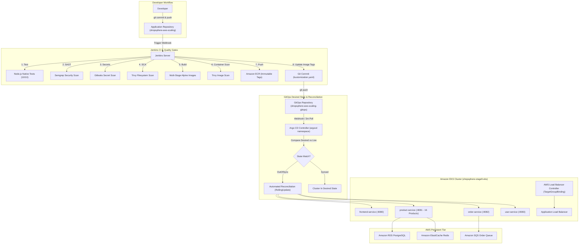

# ShopSphere Stage 10: GitOps & Argo CD Architecture

## 1. Architectural Overview

In Stage 10, ShopSphere transitions its continuous delivery model from **CI-driven imperative deployments** (`kubectl apply` executed by Jenkins) to **Declarative GitOps Delivery with Argo CD**.

The cluster state is continuously reconciled against a dedicated GitOps repository ([`shopsphere-aws-scaling-gitops`](file:///vagrant/dev_projects/shopsphere-aws-scaling/stage-10/gitops/)), establishing Git as the single source of truth for all Kubernetes workloads.



---

## 2. Key Paradigm Shifts

| Characteristic | Stage 9 (Imperative CI/CD) | Stage 10 (Declarative GitOps) |
| :--- | :--- | :--- |
| **Deployment Trigger** | Jenkins executes `kubectl apply` directly | Jenkins updates image tag in Git; Argo CD reconciles |
| **Cluster Access** | Jenkins requires cluster-admin AWS credentials | Jenkins has **zero direct access** to EKS workloads |
| **Source of Truth** | Ephemeral Jenkins build artifacts | Git repository history (`shopsphere-aws-scaling-gitops`) |
| **Configuration Drift** | Untracked; manual `kubectl` edits go unnoticed | Detected immediately; automatically healed by Argo CD |
| **Rollback Mechanism** | Manual `kubectl rollout undo` or complex script | Clean `git revert` or `git checkout` in GitOps repo |
| **Environment Templating** | Shell `sed` string replacement | Native Kustomize base + production overlay |

---

## 3. GitOps Repository Structure

```text
shopsphere-aws-scaling-gitops/
├── apps/
│   ├── frontend-service/
│   │   ├── deployment.yaml
│   │   ├── service.yaml
│   │   ├── hpa.yaml
│   │   └── kustomization.yaml
│   ├── product-service/
│   │   ├── deployment.yaml
│   │   ├── service.yaml
│   │   ├── hpa.yaml
│   │   └── kustomization.yaml
│   ├── order-service/
│   │   ├── deployment.yaml
│   │   ├── service.yaml
│   │   ├── hpa.yaml
│   │   ├── serviceaccount.yaml
│   │   └── kustomization.yaml
│   └── user-service/
│       ├── deployment.yaml
│       ├── service.yaml
│       ├── hpa.yaml
│       └── kustomization.yaml
│
├── environments/
│   └── production/
│       ├── kustomization.yaml          <-- Jenkins updates image tags here
│       ├── app-config.yaml             <-- Common non-sensitive config
│       └── target-group-binding.yaml   <-- ALB ingress bindings
│
└── argocd/
    ├── project.yaml                    <-- Argo CD AppProject definition
    └── applications/
        └── shopsphere-production.yaml  <-- Root Application resource
```

---

## 4. Kustomize Overlay Strategy

Kustomize enables modular configuration reuse without templating syntax. The base deployments in `apps/*/deployment.yaml` reference generic image names (`shopsphere-frontend`, `shopsphere-product`, etc.).

In `environments/production/kustomization.yaml`, the production overlay binds them to immutable ECR tags:

```yaml
apiVersion: kustomize.config.k8s.io/v1beta1
kind: Kustomization
namespace: shopsphere-stage9

resources:
  - ../../apps/frontend-service
  - ../../apps/product-service
  - ../../apps/order-service
  - ../../apps/user-service
  - app-config.yaml
  - target-group-binding.yaml

images:
  - name: shopsphere-frontend
    newName: 165772574557.dkr.ecr.us-east-1.amazonaws.com/shopsphere-stage9-frontend
    newTag: v10.1-64f1c1b8
  - name: shopsphere-product
    newName: 165772574557.dkr.ecr.us-east-1.amazonaws.com/shopsphere-stage9-product
    newTag: v10.1-64f1c1b8
  - name: shopsphere-order
    newName: 165772574557.dkr.ecr.us-east-1.amazonaws.com/shopsphere-stage9-order
    newTag: v10.1-64f1c1b8
  - name: shopsphere-user
    newName: 165772574557.dkr.ecr.us-east-1.amazonaws.com/shopsphere-stage9-user
    newTag: v10.1-64f1c1b8
```
