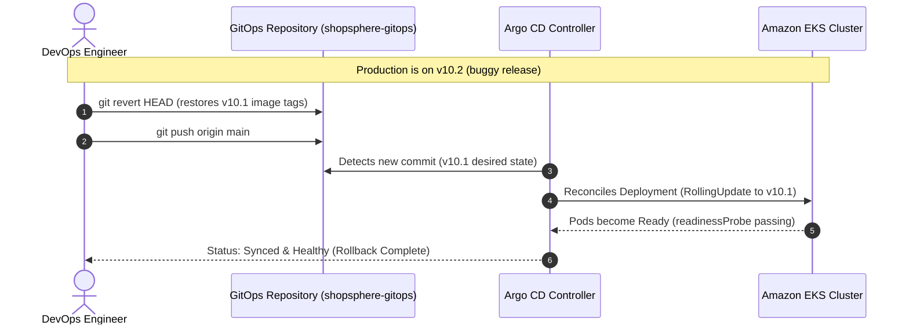

# ShopSphere Stage 10: GitOps Rollback Procedure

## 1. Core Principle: Git-Driven Rollback

In a declarative GitOps architecture, **manual rollbacks via `kubectl rollout undo` are an anti-pattern**. Any change made directly via `kubectl` creates immediate **configuration drift** that Argo CD will actively overwrite or mark as `OutOfSync`.

The only authoritative rollback mechanism is **Git reversion**.



---

## 2. Standard Rollback Execution Steps

### Scenario: Reverting from `v10.2` back to `v10.1`

#### Step 1: Clone or Navigate to the GitOps Repository
```bash
cd /vagrant/dev_projects/shopsphere-gitops
git checkout main
git pull origin main
```

#### Step 2: Review Commit History
```bash
git log -n 5 --oneline
```
Example output:
```text
c4d8e12 (HEAD -> main, origin/main) chore(release): update microservices to v10.2-abcdef12
a1b2c3d chore(release): update microservices to v10.1-98765432
```

#### Step 3: Revert the Faulty Release Commit
```bash
git revert c4d8e12 --no-edit
```
This generates a new clean commit that sets all image tags back to `v10.1`.

#### Step 4: Push the Revert Commit
```bash
git push origin main
```

#### Step 5: Observe Argo CD Automated Reconciliation
Within seconds, Argo CD detects the new desired state and begins rolling update:

```bash
# Watch Argo CD Application Status
argocd app get shopsphere-production --refresh

# Watch Kubernetes Rollout in EKS
kubectl -n shopsphere-stage9 rollout status deployment/product-service
```

---

## 3. Fast Operational Rollback (via Argo CD UI / CLI)

If urgent operational mitigation is required before a Git commit can be drafted:

```bash
# List historical revisions
argocd app history shopsphere-production

# Roll back to previous sync ID (e.g. ID 12)
argocd app rollback shopsphere-production 12
```

> [!NOTE]
> When rolling back via Argo CD CLI, automated synchronization is temporarily paused so Argo CD does not overwrite your rollback before you commit the permanent revert to Git. Once the fix is committed to Git, re-enable automated sync:
> `argocd app set shopsphere-production --sync-policy automated`
