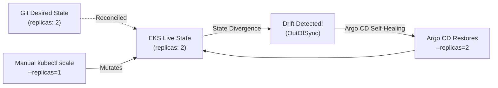

# ShopSphere Stage 10: Drift Detection & Self-Healing Demonstration

## 1. Overview of Self-Healing in GitOps

In traditional CI/CD setups, manual modifications made directly to the cluster (such as through `kubectl scale`, `kubectl edit`, or emergency debug commands) cause **Configuration Drift**. The live state diverges from the source repository, leaving the system in an unrepeatable and undocumented state.

With **Argo CD Self-Healing (`selfHeal: true`)**:
1. **Git** defines the desired state (e.g. `replicas: 2`).
2. Any unauthorized manual mutation in **EKS** creates an immediate discrepancy.
3. Argo CD's reconciliation loop flags the resource as `OutOfSync`.
4. The controller **automatically restores the live resource** to match Git.

---

## 2. Step-by-Step Demonstration



### Step 1: Verify Initial Desired State
Verify that `product-service` is running with 2 replicas as specified in Git:

```bash
kubectl get deployment product-service -n shopsphere-stage9
```
Expected output:
```text
NAME              READY   UP-TO-DATE   AVAILABLE   AGE
product-service   2/2     2            2           10m
```

### Step 2: Inject Manual Configuration Drift
Simulate an unauthorized manual intervention by scaling the deployment down to 1 replica:

```bash
kubectl scale deployment product-service -n shopsphere-stage9 --replicas=1
```

Immediately check the deployment status:
```bash
kubectl get deployment product-service -n shopsphere-stage9
```

### Step 3: Observe Argo CD Detection & Auto-Reconciliation
Within seconds, the Argo CD Application Controller discovers the mutation:

1. **Drift Flagged**:
   ```bash
   kubectl get application shopsphere-production -n argocd -o jsonpath="{.status.sync.status}"
   ```
   *Briefly reports `OutOfSync`.*

2. **Self-Healing Enforced**:
   Argo CD overrides the live state with the desired state stored in `apps/product-service/deployment.yaml`.

3. **Status Restored**:
   ```bash
   kubectl get deployment product-service -n shopsphere-stage9
   ```
   Output:
   ```text
   NAME              READY   UP-TO-DATE   AVAILABLE   AGE
   product-service   2/2     2            2           11m
   ```

Argo CD restores the second replica automatically without human intervention!

---

### Step 4: Inspect Argo CD Event Log
To view the audit trail of the self-healing event:

```bash
kubectl describe application shopsphere-production -n argocd | grep -A 10 Events:
```

Example event:
```text
Type     Reason          Age   From                    Message
----     ------          ----  ----                    -------
Normal   OperationStarted 5s    argocd-application-controller  Syncing (self-heal)
Normal   ResourceUpdated  4s    argocd-application-controller  Updated deployment product-service
```
