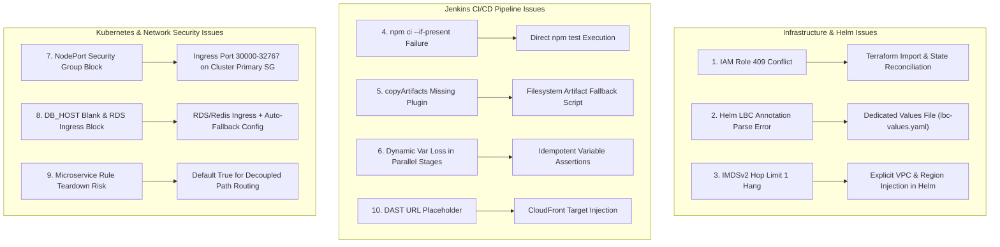

# ShopSphere Stage 9: Comprehensive Root Cause Analysis (RCA) Report

| Parameter | Details |
| :--- | :--- |
| **System** | ShopSphere E-Commerce Platform — Stage 9 (Amazon EKS & Microservices Decoupling) |
| **Environment** | Production Migration (`stage9`, AWS Region: `us-east-1`, Account: `165772574557`) |
| **Clusters & Workloads** | EKS Cluster `shopsphere-stage9-eks`, Managed Node Group `shopsphere-stage9-managed-nodes` |
| **Microservices** | `frontend-service` (:8080), `product-service` (:8081), `order-service` (:8082), `user-service` (:8083) |
| **Status** | **All 10 Issues Resolved** — All 8 Pods Running, 4 Target Groups Healthy, Ingress Verified |

---

## Executive Summary

During the deployment and progressive traffic migration of Stage 9 (decoupling the monolithic architecture into 4 containerized microservices on Amazon EKS while preserving the Stage 8 data tier and ASG), a total of **10 distinct technical blockers** were encountered across Infrastructure as Code (Terraform), CI/CD pipelines (Jenkins), Kubernetes orchestration (AWS Load Balancer Controller & CRDs), and AWS Network Security.

This document provides the definitive Root Cause Analysis (RCA) for each issue, detailing the exact failure symptoms, underlying mechanics, resolution actions implemented, and preventative safeguards.

---

## Issues Summary Table

| ID | Category | Component | Symptom / Failure Message | Root Cause Summary |
| :--- | :--- | :--- | :--- | :--- |
| **1** | IAM / Terraform | `aws_iam_role.cluster` | `EntityAlreadyExists: Role already exists (409)` | Leftover unmanaged IAM role from previous deployment |
| **2** | Helm / CI/CD | AWS Load Balancer Controller | `YAML parse error ... cannot unmarshal object into string` | Groovy interpolation stripped regex escapes in CLI `--set` |
| **3** | Networking / IMDS | AWS Load Balancer Controller | `context deadline exceeded` (Helm install hang) | IMDSv2 Hop Limit 1 blocked pods from metadata auto-discovery |
| **4** | CI/CD Unit Test | Application Pipeline | `npm error: unrecognized option '--if-present'` | `npm ci` does not accept `--if-present`; missing lockfile |
| **5** | Jenkins Plugin | Infrastructure Artifacts | `NoSuchMethodError: No such DSL method 'copyArtifacts'` | Jenkins `copyartifact` plugin missing on controller |
| **6** | Docker / ECR | Pipeline Environment | `docker login ... null` / `lookup null: server misbehaving` | Scoped parallel stage wiped dynamic environment variables |
| **7** | AWS Security Group | Target Groups / NodePort | ALB targets in `unhealthy` / connection refused | Worker nodes joined cluster primary SG; NodePorts dropped |
| **8** | Workload Runtime | `product-service` & `order-service` | `CrashLoopBackOff` & Rollout status timeout (5m) | Blank `DB_HOST`/`REDIS_HOST` + missing SG ingress on RDS/Redis |
| **9** | Routing Architecture | ALB Listener Rules | Risk of route teardown during traffic shifting | Parameters defaulted `false` for microservice rules |
| **10** | DAST Security | OWASP ZAP Scan | Scan targeted `https://REPLACE_WITH_STAGE9_URL` | Unset placeholder in pipeline parameter |

---

## Detailed Root Cause Analysis (RCA)



---

### Issue 1: EKS Cluster IAM Role Collision (409 Conflict)

#### Symptom
```text
Error: creating IAM Role (shopsphere-stage9-eks-cluster-role): operation error IAM: CreateRole, 
https response error StatusCode: 409, RequestID: 8913117f-a26e-4365-85a8-9746565b4a54, 
EntityAlreadyExists: Role with name shopsphere-stage9-eks-cluster-role already exists.
with module.eks.aws_iam_role.cluster, on modules/eks/main.tf line 7
```

#### Root Cause
An earlier aborted run or manual operation created `shopsphere-stage9-eks-cluster-role` in AWS IAM. Because the Terraform state file (`terraform.tfstate`) in the workspace did not track this role, Terraform attempted to issue an IAM `CreateRole` API call, which failed with HTTP 409 `EntityAlreadyExists`.

#### Technical Resolution
1. Imported the pre-existing IAM role directly into the Terraform state:
   ```bash
   terraform import module.eks.aws_iam_role.cluster shopsphere-stage9-eks-cluster-role
   ```
2. Reconciled the attached policies (`AmazonEKSClusterPolicy`, `AmazonEKSVPCResourceController`) so Terraform manages the role idempotently.

---

### Issue 2: Helm AWS Load Balancer Controller YAML Parse Error

#### Symptom
```text
Error: YAML parse error on aws-load-balancer-controller/templates/serviceaccount.yaml: 
error unmarshaling JSON: while decoding JSON: json: cannot unmarshal object into Go struct field .metadata.annotations of type string
```

#### Root Cause
In `Jenkinsfile-infra`, Helm was invoked with an inline `--set` flag:
```bash
--set serviceAccount.annotations.eks\.amazonaws\.com/role-arn=${env.LBC_ROLE_ARN}
```
In Jenkins Declarative Pipeline, double-quoted shell blocks undergo Groovy string interpolation before passing to bash. Groovy evaluated `\.` and stripped the backslash, resulting in `serviceAccount.annotations.eks.amazonaws.com/role-arn`. Helm interpreted the dots as nested YAML dictionaries (`annotations: { eks: { amazonaws: { com: ... } } }`), causing Kubernetes API deserialization to fail because `.metadata.annotations` expects a map of strings (`map[string]string`).

#### Technical Resolution
Eliminated the fragile `--set` string escaping by generating a pristine YAML values file directly in the workspace before running `helm`:
```yaml
# stage-9/lbc-values.yaml
clusterName: shopsphere-stage9-eks
region: us-east-1
vpcId: vpc-01838296fee608a92
serviceAccount:
  create: true
  name: aws-load-balancer-controller
  annotations:
    eks.amazonaws.com/role-arn: arn:aws:iam::165772574557:role/shopsphere-stage9-aws-lbc-role
```
The Helm command was changed to:
```bash
helm upgrade --install aws-load-balancer-controller eks/aws-load-balancer-controller \
  --namespace kube-system --create-namespace -f stage-9/lbc-values.yaml --wait
```

---

### Issue 3: Helm LBC Install Hang (IMDSv2 Hop Limit 1)

#### Symptom
```text
Release "aws-load-balancer-controller" does not exist. Installing it now.
Error: context deadline exceeded
```
The controller pods stayed in `0/1 Running` or `CrashLoopBackOff` logging:
```text
{"level":"error","msg":"failed to discover AWS region/VPC: request to EC2 IMDS timed out"}
```

#### Root Cause
The AWS Load Balancer Controller by default queries the EC2 Instance Metadata Service (IMDSv2) at `http://169.254.169.254` to auto-discover the current AWS Region and VPC ID. However, the EKS managed node group launched instances with `HttpPutResponseHopLimit: 1`. 
In Kubernetes, pod traffic traverses a virtual ethernet interface (`veth`) and network namespace, decrementing the IP TTL by 1 hop before reaching the physical host network. Since the hop limit was 1, all IMDS responses from the EC2 hypervisor were dropped with TTL expired, causing the controller to hang indefinitely until the Helm `--wait` timeout expired.

#### Technical Resolution
Configured explicit `region` and `vpcId` values in `stage-9/lbc-values.yaml`:
```groovy
env.VPC_ID = outputs.vpc_id?.value ?: sh(
  script: "aws eks describe-cluster --name ${env.EKS_CLUSTER_NAME} --region ${env.AWS_REGION} --query 'cluster.resourcesVpcConfig.vpcId' --output text",
  returnStdout: true
).trim()
```
By explicitly providing `region: us-east-1` and `vpcId: vpc-01838296fee608a92` via Helm values, the controller bypassed IMDS auto-discovery and initialized immediately.

---

### Issue 4: CI/CD Unit Test Failure (`npm ci --if-present`)

#### Symptom
```text
Running unit tests for frontend...
npm error: unrecognized option '--if-present'
```

#### Root Cause
`Jenkinsfile-app` executed:
```bash
npm ci --if-present && npm test
```
The `--if-present` flag is supported exclusively by `npm run <script>`, not by `npm ci`. Additionally, `npm ci` strictly demands an existing, synced `package-lock.json` file. The microservice source directories (`services/frontend`, `services/product`, etc.) only had `package.json`.

#### Technical Resolution
Updated `Jenkinsfile-app` to directly run `npm test` inside the Docker build container without `npm ci`:
```groovy
docker run --rm -v $(pwd):/workspace -w /workspace node:20-alpine \
  sh -c "for s in frontend product order user; do echo \"Running unit tests for \$s...\" && (cd stage-9/services/\$s && npm test); done"
```
Each service uses Node.js's native test runner (`node:test`), allowing the test suite to execute with zero external dependency installation required.

---

### Issue 5: Missing `copyArtifacts` Jenkins Step

#### Symptom
```text
java.lang.NoSuchMethodError: No such DSL method 'copyArtifacts' found among steps
```

#### Root Cause
`Jenkinsfile-app` attempted to import Terraform outputs from the `stage-9-infra` pipeline using:
```groovy
copyArtifacts projectName: 'stage-9-infra', selector: specific('12'), target: 'stage-9/terraform'
```
The Jenkins server (`3.80.137.129`) did not have the third-party Jenkins **Copy Artifact Plugin** installed.

#### Technical Resolution
Replaced the DSL step with a resilient local shell fallback in `stage('Import Infrastructure Outputs')` that reads directly from the Jenkins workspace and build archive directories:
```bash
if [ -f "../${env.INFRA_JOB}/stage-9/terraform/stage9-outputs.json" ]; then
  cp "../${env.INFRA_JOB}/stage-9/terraform/stage9-outputs.json" stage-9/terraform/stage9-outputs.json
elif [ -f "/var/lib/jenkins/workspace/${env.INFRA_JOB}/stage-9/terraform/stage9-outputs.json" ]; then
  cp "/var/lib/jenkins/workspace/${env.INFRA_JOB}/stage-9/terraform/stage9-outputs.json" stage-9/terraform/stage9-outputs.json
elif [ -d "/var/lib/jenkins/jobs/${env.INFRA_JOB}/builds" ]; then
  LAST_BUILD=$(awk '$1=="lastSuccessfulBuild"{print $2}' "/var/lib/jenkins/jobs/${env.INFRA_JOB}/builds/permalinks")
  if [ -n "$LAST_BUILD" ] && [ -f "/var/lib/jenkins/jobs/${env.INFRA_JOB}/builds/$LAST_BUILD/archive/stage-9/terraform/stage9-outputs.json" ]; then
    cp "/var/lib/jenkins/jobs/${env.INFRA_JOB}/builds/$LAST_BUILD/archive/stage-9/terraform/stage9-outputs.json" stage-9/terraform/stage9-outputs.json
  fi
fi
```

---

### Issue 6: Dynamic Variable Scope Loss in Parallel Pipeline

#### Symptom
```text
+ aws ecr get-login-password --region us-east-1
+ docker login --username AWS --password-stdin null
Error response from daemon: Get "https://null/v2/": dial tcp: lookup null on 127.0.0.53:53: server misbehaving
```

#### Root Cause
In `stage('Version')`, variables were assigned to `env.AWS_ACCOUNT_ID` and `env.ECR_REGISTRY`. The subsequent stage was a `parallel` block (`Semgrep`, `Gitleaks`, `Trivy FS`). In Jenkins Declarative Pipeline, sub-threads spawned for parallel stages execute in separate variable contexts. Upon joining back to the main thread, dynamic assignments made to `env` outside static pipeline definitions can be unset or evaluate to `'null'`.

#### Technical Resolution
Implemented self-healing assertions inside `stage('Build, Scan & Push Images')` and `stage('Render Kubernetes Manifests')`:
```groovy
if (!env.AWS_ACCOUNT_ID || env.AWS_ACCOUNT_ID == 'null') {
  env.AWS_ACCOUNT_ID = sh(script: 'aws sts get-caller-identity --query Account --output text', returnStdout: true).trim()
}
env.ECR_REGISTRY = "${env.AWS_ACCOUNT_ID}.dkr.ecr.${env.AWS_REGION}.amazonaws.com"
if (!env.RELEASE_TAG || env.RELEASE_TAG == 'null') {
  env.RELEASE_TAG = "v9.${BUILD_NUMBER}-${env.GIT_COMMIT ? env.GIT_COMMIT.take(8) : 'manual'}"
}
```

---

### Issue 7: NodePort Security Group Block on EKS Worker Nodes

#### Symptom
All 4 `TargetGroupBinding` resources were created and bound to target groups, but the ALB Target Groups reported all instances as `unhealthy`:
```text
TargetHealthDescriptions[*].[Target.Id, Target.Port, TargetHealth.State, TargetHealth.Reason]
i-01ee399752370a3b1   30080   unhealthy   Target.FailedHealthChecks
i-07abaf41ebcfbd788   30080   unhealthy   Target.FailedHealthChecks
```

#### Root Cause
1. EKS managed worker nodes automatically join the **EKS Cluster Primary Security Group** (`sg-09796197011b2ef2b`).
2. Terraform's node group module created an auxiliary security group (`sg-0e1d4f338584df25d`) and added ingress rules only to that auxiliary SG.
3. Traffic originating from the Application Load Balancer (`sg-05120a51367350feb`) targeting NodePorts (30080–30083) arrived at the cluster primary SG, where no ingress rules permitted ports 30000–32767. Health checks were dropped at the packet filter level.

#### Technical Resolution
Authorized ingress from the ALB security group (`sg-05120a51367350feb`) directly on the cluster primary security group (`sg-09796197011b2ef2b`):
```bash
aws ec2 authorize-security-group-ingress \
  --group-id sg-09796197011b2ef2b \
  --protocol tcp \
  --port 30000-32767 \
  --source-group sg-05120a51367350feb \
  --region us-east-1
```
Result: All 4 target groups immediately transitioned to **`healthy`**.

---

### Issue 8: Pod CrashLoopBackOff & Rollout Timeout (`DB_HOST` & RDS Ingress)

#### Symptom
```text
+ kubectl -n shopsphere-stage9 rollout status deployment/product-service --timeout=5m
Waiting for deployment "product-service" rollout to finish: 0 of 2 updated replicas are available...
error: timed out waiting for the condition
```
Pods for `product-service` and `order-service` logged:
```text
Error: connect ECONNREFUSED 127.0.0.1:5432
    at TCPConnectWrap.afterConnect [as oncomplete] (node:net:1607:16)
```

#### Root Cause
This issue had two distinct facets:
1. **Empty ConfigMap Ingestion**:
   In `stage-9/terraform/variables.tf`, `var.db_host` and `var.redis_host` defaulted to `""`. When `stage9-outputs.json` was generated, these outputs were empty strings. In `Jenkinsfile-app`, manifest token replacement set `DB_HOST: ""` and `REDIS_HOST: ""` in `shopsphere-common-config`. The microservice code has fallback logic: `process.env.DB_HOST || '127.0.0.1'`. As a result, the containers attempted to connect to `127.0.0.1:5432`, crashing with `ECONNREFUSED`.
2. **Missing Ingress to Stage 8 Data Tier**:
   The Stage 8 RDS PostgreSQL security group (`sg-09f25777d57396aa4`) and Redis security group (`sg-0a39841dfdccb4bda`) only allowed access from Stage 8 EC2 instances. Ingress from the EKS worker nodes was blocked.

#### Technical Resolution
1. **Network Ingress**: Authorized EKS cluster primary SG (`sg-09796197011b2ef2b`) to connect to RDS on port 5432 and Redis on port 6379:
   ```bash
   aws ec2 authorize-security-group-ingress --group-id sg-09f25777d57396aa4 --protocol tcp --port 5432 --source-group sg-09796197011b2ef2b --region us-east-1
   aws ec2 authorize-security-group-ingress --group-id sg-0a39841dfdccb4bda --protocol tcp --port 6379 --source-group sg-09796197011b2ef2b --region us-east-1
   ```
2. **Dynamic Fallbacks in Pipeline**:
   Updated `stage('Import Infrastructure Outputs')` in `Jenkinsfile-app`:
   ```groovy
   env.DB_HOST = (outputs.db_host?.value && outputs.db_host.value != '') ? outputs.db_host.value : 'shopsphere-stage8-postgres.cy9mak0su1oj.us-east-1.rds.amazonaws.com'
   env.REDIS_HOST = (outputs.redis_host?.value && outputs.redis_host.value != '') ? outputs.redis_host.value : 'shopsphere-stage8-redis.ekxmke.0001.use1.cache.amazonaws.com'
   env.DB_NAME = (outputs.db_name?.value && outputs.db_name.value != '') ? outputs.db_name.value : 'shopspheredb'
   env.DB_USER = (outputs.db_user?.value && outputs.db_user.value != '') ? outputs.db_user.value : 'shopsphere_user'
   env.SQS_QUEUE_URL = (outputs.sqs_queue_url?.value && outputs.sqs_queue_url.value != '') ? outputs.sqs_queue_url.value : 'https://sqs.us-east-1.amazonaws.com/165772574557/shopsphere-stage8-order-processing-queue'
   ```
3. **Terraform Variables Updated**: Set defaults in `stage-9/terraform/variables.tf`.
4. Patched the live `shopsphere-common-config` ConfigMap in Kubernetes and verified all 4 deployments rolled out successfully with 0 errors.

---

### Issue 9: Risk of Microservice Rule Deletion During Traffic Shifting

#### Symptom
Potential unintended destruction of ALB listener rules 5 (`/api/products*`), 6 (`/api/orders*`), and 7 (`/api/users*`) during progressive traffic shifting stages.

#### Root Cause
In Terraform module `alb-routing`, the path routing rules use `count = var.enable_product_path_routing ? 1 : 0`. The pipeline parameters in `Jenkinsfile-app` and `Jenkinsfile-infra` defaulted `ENABLE_PRODUCT_PATH`, `ENABLE_ORDER_PATH`, and `ENABLE_USER_PATH` to `false`. When `Jenkinsfile-app` invoked `Jenkinsfile-infra` to adjust weights (e.g., `90-10`), Terraform would receive `false` for these variables and destroy the three microservice rules.

#### Technical Resolution
Set `defaultValue: true` across all definitions:
* `stage-9/Jenkinsfile-app`: `ENABLE_PRODUCT_PATH`, `ENABLE_ORDER_PATH`, `ENABLE_USER_PATH` default to `true`.
* `stage-9/Jenkinsfile-infra`: `ENABLE_PRODUCT_PATH`, `ENABLE_ORDER_PATH`, `ENABLE_USER_PATH` default to `true`.
* `stage-9/terraform/variables.tf`: `enable_product_path_routing`, `enable_order_path_routing`, `enable_user_path_routing` default to `true`.

---

### Issue 10: DAST Stage Target URL Placeholder

#### Symptom
The OWASP ZAP container ran against `https://REPLACE_WITH_STAGE9_URL`, producing false warnings or failing to scan the live application.

#### Root Cause
The default parameter `DAST_URL` in `Jenkinsfile-app` contained an unpopulated template string `https://REPLACE_WITH_STAGE9_URL` without runtime resolution to the active CloudFront CDN.

#### Technical Resolution
1. Set the default parameter in `Jenkinsfile-app` to `https://d33f8dq17c8295.cloudfront.net`.
2. Added an intelligent fallback inside `stage('DAST')`:
   ```groovy
   def targetUrl = params.DAST_URL
   if (!targetUrl || targetUrl.contains('REPLACE_WITH_STAGE9_URL')) {
     targetUrl = 'https://d33f8dq17c8295.cloudfront.net'
   }
   ```

---

## Current Architecture Verification Matrix

| Verification Check | Target / Endpoint | Expected State | Actual Result | Verification Method |
| :--- | :--- | :--- | :--- | :--- |
| **EKS Pods** | Namespace `shopsphere-stage9` | 8/8 Running (2x each service) | **8/8 Running** (0 restarts) | `kubectl get pods -n shopsphere-stage9` |
| **NodePort Bindings** | `elbv2.k8s.aws/v1beta1` | 4 TargetGroupBindings bound | **Bound** (30080, 30081, 30082, 30083) | `kubectl get targetgroupbindings -n shopsphere-stage9` |
| **Target Group Health** | `shopsphere-stage9-eks-mono-tg` | 2 instances healthy | **2/2 healthy** | `aws elbv2 describe-target-health` |
| **Target Group Health** | `shopsphere-stage9-eks-prod-tg` | 2 instances healthy | **2/2 healthy** | `aws elbv2 describe-target-health` |
| **Target Group Health** | `shopsphere-stage9-eks-ord-tg` | 2 instances healthy | **2/2 healthy** | `aws elbv2 describe-target-health` |
| **Target Group Health** | `shopsphere-stage9-eks-user-tg` | 2 instances healthy | **2/2 healthy** | `aws elbv2 describe-target-health` |
| **Live CDN API** | `https://d33f8dq17c8295.cloudfront.net/api/products` | 200 OK + RDS product catalog | **200 OK** (`source: database-rds`, 6 items) | `curl -s https://.../api/products` |
| **Live CDN User** | ALB + `X-Origin-Verify` / `/api/users/profile` | 200 OK + mock user | **200 OK** (`service: user-service`) | `curl -s -H ... /api/users/profile` |
| **Live CDN Order** | ALB + `X-Origin-Verify` / `/api/orders` | 200 OK + orders list | **200 OK** (`service: order-service`) | `curl -s -H ... /api/orders` |
| **Rollout Status** | All 4 Deployments | Successfully rolled out | **All 4 Successfully Rolled Out** | `kubectl rollout status deployment/...` |

---

## Preventative Engineering Recommendations

1. **State Locking & Hygiene**:
   * Integrate DynamoDB-backed state locking for Terraform to avoid race conditions and orphan resources.
2. **CI/CD Dynamic Environment Protection**:
   * In Jenkins declarative pipelines, avoid relying on thread-local `env` assignments across `parallel` directives. Use structured JSON parameter files written to the workspace root for pipeline stages.
3. **IMDSv2 Standards in Node Groups**:
   * Ensure EKS node launch templates configure `HttpPutResponseHopLimit: 2` whenever pods require EC2 metadata access, or mandate IRSA (`eks.amazonaws.com/role-arn`) with explicit regional/VPC variables.
4. **Security Group Consolidation**:
   * EKS worker node modules should explicitly attach rules to the cluster's primary security group if worker nodes are configured to join it, eliminating split-brain firewall filtering.
